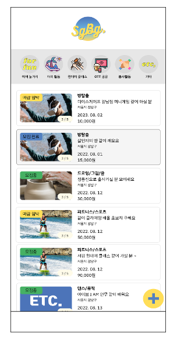
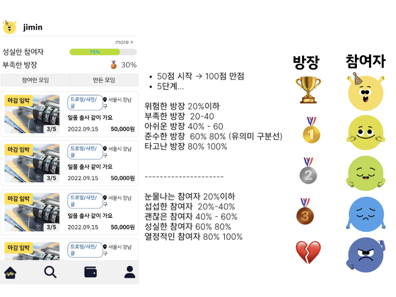
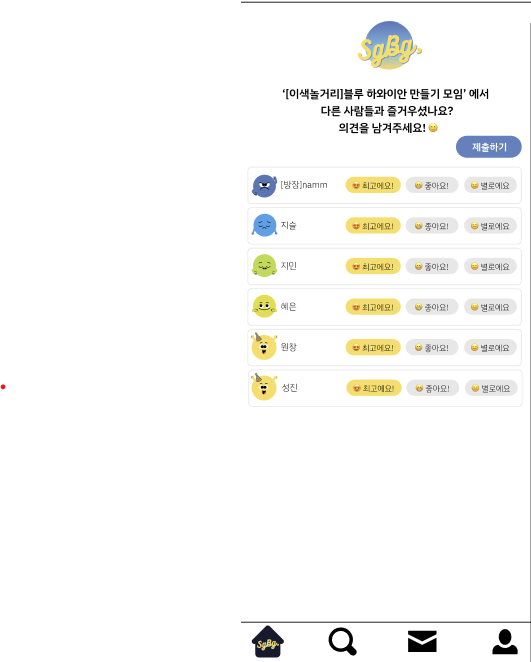
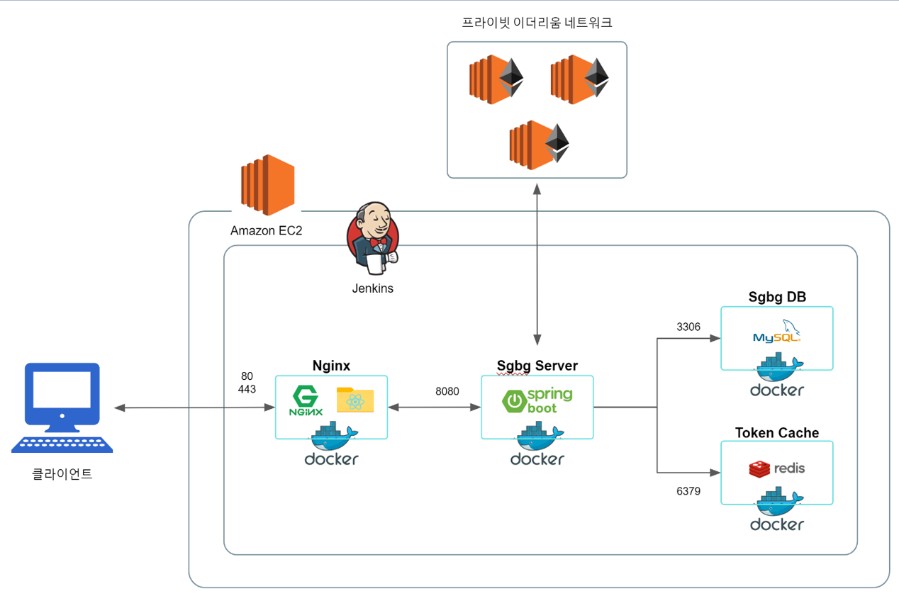

# 혼자여서 싱글, 같이여서 벙글, 싱글벙글

## 🙍혼자하기 힘든, 혼자하기 싫은 사람들을 위한
## 🧑‍🤝‍🧑블록체인 기반 단기 모임 서비스

 

## 🗂️ 프로젝트 소개
### 🧚 혼자여도 다양하게 놀 수 있어요! 블록 체인 기반으로 안전하게 모임을 찾아보세요

### ✅ 방장일 때, 참여자일 때의 유저 점수를 각각 다르게 파악할 수 있어요

### 🪙 블록체인에 모임 정보가 모두 저장되어 신뢰할 수 있어요!

### ✍️ 모임 후엔 리뷰를 남겨주세요

 

## 시스템 아키텍처

## 기술 스택
#### FrontEnd

 

##### BackEnd

 

##### Communitcation Tool

 

##### Development Tool

## 산출물

- [원페이퍼 기획서](https://heather-slice-e94.notion.site/265e48fade1f45e3b7e9a084a7acf1bd)

- [기능 명세서](https://heather-slice-e94.notion.site/157e13f6513b4a4eb99c1805e35f6247)

- [API 명세서](https://heather-slice-e94.notion.site/API-a81538d6752d439cbcaf080da71eeff0)

- [ER 다이어그램](https://heather-slice-e94.notion.site/ER-37043edd33be4312838641545e3eaa80)

 

### 팀원 소개

| 이름   |
| ------ |
| 김성진 (BE) |
| 박남주 (FE)  
| 박원창 (BE) |
|  유지슬 (BE)|
| 임지민 (FE) |
| 조혜은 (BE) |

 
